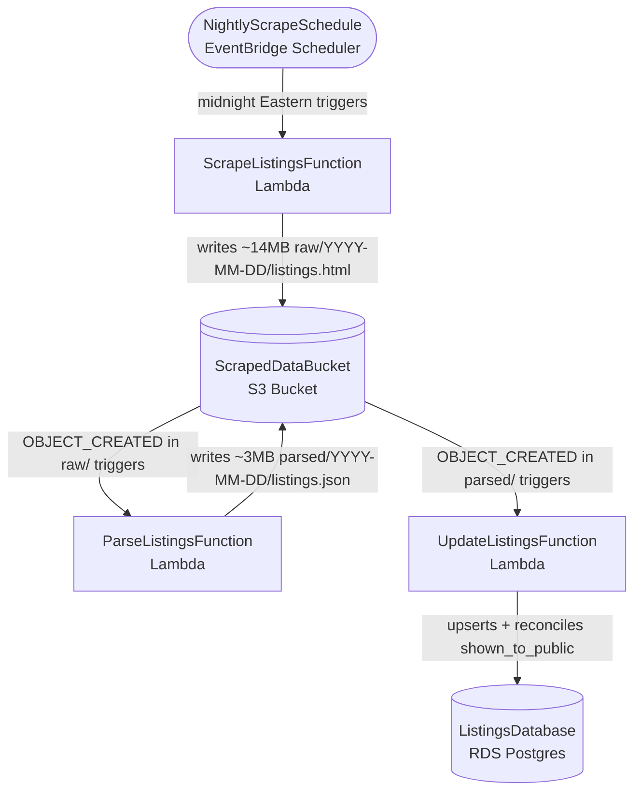
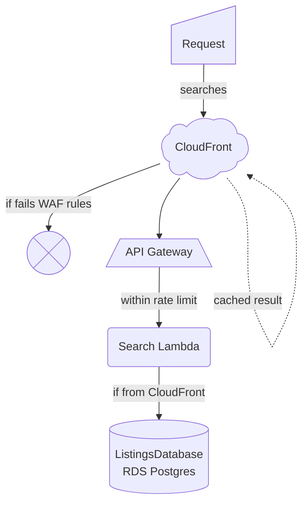

# Tenant Access

A tenant access application for the New Jersey Innovation Authority. This application provides secure access management and interfaces for tenants.

## Table of Contents

1. [Architecture](#architecture)
2. [Installation](#installation)
3. [Usage](#usage)
4. [Testing](#testing)
5. [Code Quality](#code-quality)
6. [License](#license)
7. [Disclaimer](#disclaimer)

## Architecture

This is a modern React application built with Vite and TypeScript, organized as an npm workspace monorepo. The project emphasizes type safety, testing, and code quality through automated tooling.

### Built With

- [React 19](https://react.dev/) - UI library
- [React Router 7](https://reactrouter.com/) - Client-side routing
- [TypeScript 7](https://www.typescriptlang.org/) - Type-safe JavaScript
- [Vite 8](https://vite.dev/) - Build tool and dev server
- [Vitest 4](https://vitest.dev/) - Unit testing framework
- [Testing Library](https://testing-library.com/) - Component testing utilities
- [Biome](https://biomejs.dev/) - Linting and formatting
- [Husky](https://typicode.github.io/husky/) - Git hooks

### Project Structure

```
tenant-access/
├── app/              # Frontend application workspace (React + Vite)
│   ├── src/          # Application source code
│   ├── public/       # Static assets
│   └── package.json  # App-specific dependencies
├── api/              # Backend workspace (AWS Lambda, TypeScript)
│   ├── src/          # Lambda handler source code
│   └── package.json  # API-specific dependencies
├── .github/          # GitHub workflows and templates
├── .husky/           # Git hooks
└── package.json      # Root workspace configuration
```

The `api` workspace is a minimal skeleton for the planned backend: a Lambda
that communicates with a PostgreSQL database. It is configured for a Node
runtime (its own `tsconfig.json`, separate from the frontend) with a
placeholder handler. Build tooling, database client, and deployment are not
yet chosen. Build/typecheck it with `npm run build:api`.

## Installation

### Prerequisites

- Node.js (version specified in `.nvmrc`)
- npm (comes with Node.js)

### Setup

```bash
# Clone this repository
git clone https://github.com/newjersey/tenant-access

# Go into the repository
cd tenant-access

# Install dependencies
npm install
```

### Adding Dependencies

This is an npm workspace monorepo: the root `package.json` owns the workspace configuration and the single `package-lock.json`, and dependencies are hoisted to the root `node_modules`. **Always install from the repository root**, targeting the `app` workspace:

```bash
# Runtime dependency for the app
npm install <package> --workspace=app

# Dev-only dependency for the app
npm install --save-dev <package> --workspace=app
```

Commit the updated `app/package.json` and the root `package-lock.json` together in the same change. CI runs `npm ci`, which installs strictly from the committed lockfile and fails if it is out of sync with `package.json`.

### Test DB Setup

To run backend tests that depend on a Postgres DB, we need containerization [as described in the Engineering Wiki](https://newjersey.github.io/innovation-engineering/tech-recommendations/infrastructure/#containerization) on your local machine (and GitHub Actions on ubuntu will run the equivalent with their pre-installed docker).

```
brew install colima docker docker-compose

# you may need to explicitly link docker compose on your local machine like this
mkdir -p ~/.docker/cli-plugins
ln -sfn "$(brew --prefix)/lib/docker/cli-plugins/docker-compose" ~/.docker/cli-plugins/docker-compose

colima start --vm-type=vz --vz-rosetta --mount-type=virtiofs

# optional: this makes colima run in background, even persisting across reboots
brew services start colima
```

If any new file involves SQL syntax, you must add it to `test/coverage/include` in `vitest.db.config.ts` to make sure the test coverage stays strong going forward.

## Infrastructure

This project uses the AWS CDK to deploy its infrastructure. To make updates, edit `api/infrastructure/lib/tenant-access-stack.ts` and then run `npx cdk deploy` with the proper AWS credentials in your environment variables.

### Temporary Data Infrastructure

This part of the infrastructure should only be running while the legacy application is still the source of truth. Once our application can serve as the source of truth, the EventBridge Scheduler, ScrapeListings Lambda, ScrapedDataBucket, and ParseListings Lambda can all be deprecated (the UpdateListings Lambda and ListingsDatabase would remain).



### Application Backend

Once per environment, the following line needs to be run so that there's a secret that allows the Lambdas to check that all requests must go through CloudFront so they hit all the security rules.

```
aws secretsmanager create-secret --name tenant-access/origin-secret \
  --secret-string "$(openssl rand -base64 32 | tr -d '/+=' | cut -c1-32)"
```

Security considerations:
* IP-based rate limiting
* AWS-managed IP reputation check (`AWSManagedRulesAmazonIpReputationList`)
* AWS-managed threat check (`AWSManagedRulesCommonRuleSet`)
* A secret header passed by CloudFront that is checked by the Lambda and never seen by the browser (so everyone has to go in the front door, no climbing up into the bedroom window like a teen in a movie)

Performance considerations:
* CloudFront will cache results and return them when it can
* Searches only return 20 results at a time
* Pagination and counting only go 1001 deep into results
* Lambda instances are capped to not make our costs explode in a worst-case scenario



### Endpoints

<details>
<summary><code>/listings/search?page=3&location=newark</code></summary>

Returns JSON of max-20 listings, plus the total count (max 1001) of listings that meet search criteria.

Increment `page` to get later pages of results. Any number above 50 reverts to 50.

Change `location` (ONLY searches by city name right now), or make it blank to return all locationss
</details>

### Frontend Hosting

The React app in `app/` is hosted by AWS Amplify, which is **not** managed by the CDK stack in
this repo. Each AWS account has its own Amplify app connected to this GitHub repository,
watching a single branch:

| Branch | AWS account |
| --- | --- |
| `dev` | Dev |
| `main` | Prod |

Pushing to one of those branches triggers an Amplify build automatically through a [webhook](https://github.com/newjersey/tenant-access/settings/hooks) (not a GitHub Action). To change any configuration, use the Amplify console in the relevant account.

`amplify.yml` in the repository root is the build spec Amplify reads. It builds the frontend only (`app/dist`).

Both environments are currently password-protected because the application is not ready for launch. The Prod restriction should be removed at launch; Dev can keep it indefinitely. The username and password are available in `Project Info` in the `#tenant-access` Innovation Slack channel.

`VITE_API_BASE_URL` is set as an Environment Variable on Amplify.

## Database Migrations

### Create Migration File

```bash
# Create a new migration file with the date prefix
bash api/scripts/create_migration.sh <description>

# Example:
# bash api/scripts/create_migration.sh create_listings_table

# This creates the file:
# api/migrations/20260804110544_create_listings_table.sql

# Then edit your new migration file with SQL
```

### Execute Migration

1. The Migration Lambda in the `tenant-access-stack.ts` CDK config file is bundled with the whole `api/migrations` directory. Even thought the Lambda's code itself will rarely change, we need to do a CDK deployment to include any new migration files.

2. Run `npx cdk deploy` to package the Lambda with the updated directory of migrations.

3. Note the `MigrationLambdaName` in the output of `npx cdk deploy`.
For example, `TenantAccessStack.MigrationLambdaName = TenantAccessStack-MigrationFunction1060F2E0-DfbZthsVWubo`

3. Run the lambda with its name and the filename for the new migration.

```
aws lambda invoke \
    --function-name INSERT_LAMBDA_NAME \
    --cli-binary-format raw-in-base64-out \
    --payload '{"migrationFile":"INSERT_SQL_FILENAME"}' \
    /tmp/out.json && cat /tmp/out.json

# For example:

aws lambda invoke \
    --function-name TenantAccessStack-MigrationFunction1060F2E0-DfbZthsVWubo \
    --cli-binary-format raw-in-base64-out \
    --payload '{"migrationFile":"20260804110544_create_listings_table.sql"}' \
    /tmp/out.json && cat /tmp/out.json
```

If you see a happy JSON like `{"statusCode":200,"body":"{\"success\":true,\"migration\":\"20260804110544_create_listings_table.sql\",\"message\":\"Migration completed successfully\"}"}`, it was a success. Otherwise, you can debug using CloudWatch.

## Usage

### Development

Start the development server with hot module replacement:

```bash
npm run dev
```

The application will be available at `http://localhost:5173`

### Build

Create a production build:

```bash
npm run build
```

### Preview

Preview the production build locally:

```bash
npm run preview
```

## Testing

### Run Tests

```bash
# Run tests in watch mode
npm test

# Run tests with UI
npm run test:ui

# Run tests with coverage report
npm run test:coverage
```

## Code Quality

### Linting and Formatting

```bash
# Check formatting
npm run format:check

# Fix formatting issues
npm run format

# Run linter
npm run lint

# Fix linting issues
npm run lint:fix

# Run both checks and fixes
npm run check:fix
```

Git hooks are configured via Husky to automatically run code quality checks on commit.

### Development Principles

- Test-driven development (TDD)
- YAGNI - build only what's needed now
- Accessibility (WCAG 2.2 AA compliance)
- Simple, maintainable solutions over clever complexity

## License

This project is licensed under the MIT license. For more information, see [LICENSE](LICENSE).

## Disclaimer

This project utilizes certain tools and technologies for development purposes. The inclusion of these tools does not imply endorsement or recommendation. Users are encouraged to evaluate the suitability of these tools for their own use.
