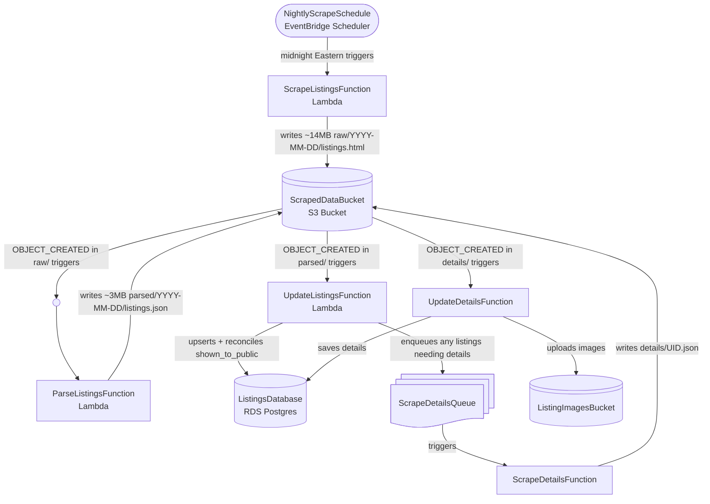
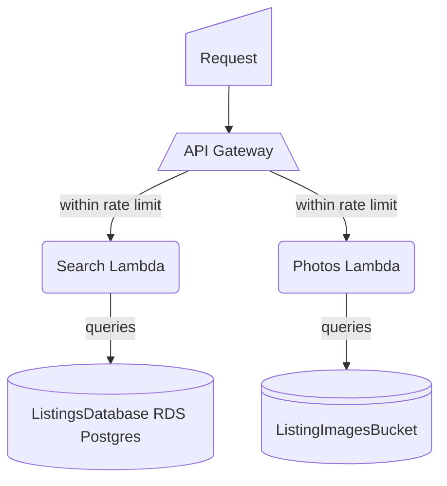

# Tenant Access

A affordable housing application for the New Jersey Housing and Mortgage Finance Agency (NJHMFA) developed with the New Jersey Innovation Authority (NJIA). This application provides a searchable list of properties for potential tenants. Future features may include property manager and tenant accounts, and listing management.

## Table of Contents

1. [Architecture](#architecture)
2. [Installation](#installation)
3. [Infrastructure](#infrastructure)
4. [Database Migrations](#database-migrations)
5. [Usage](#usage)
6. [Testing](#testing)
7. [Code Quality](#code-quality)
8. [Monitoring](#monitoring)
9. [Analytics and Feedback](#analytics-and-feedback)
10. [License](#license)
11. [Disclaimer](#disclaimer)

## Architecture

This is a monorepo with npm, with both frontend and backend in Typescript. The frontend, in `app/`, is a React application. The backend, in `api/`, is AWS CDK-managed infrastructure.

### Built With

- [AWS CDK](https://aws.amazon.com/cdk/) - Amazon Web Services Cloud Development Kit
- [PostgreSQL](https://www.postgresql.org/) - SQL database
- [React](https://react.dev/) - UI library
- [React Router](https://reactrouter.com/) - Client-side routing
- [TypeScript](https://www.typescriptlang.org/) - Type-safe JavaScript
- [Vite](https://vite.dev/) - Build tool and dev server
- [Vitest](https://vitest.dev/) - Unit testing framework
- [Testing Library](https://testing-library.com/) - Component testing utilities
- [Playwright](https://playwright.dev/) - End-to-end frontend testing
- [Biome](https://biomejs.dev/) - Linting and formatting
- [Husky](https://typicode.github.io/husky/) - Git hooks

See the package.json for the full list of dependencies and versions.

### Project Structure

```
tenant-access/
├── app/                # Frontend application workspace (React + Vite)
│   ├── src/            # Application source code
│   ├── public/         # Static assets
│   └── package.json    # App-specific dependencies
├── api/                # Backend workspace (AWS Lambda, TypeScript)
    ├── fixtures/       # Example HTML and JSON for use in backend tests
    ├── infrastructure/ # CDK
    ├── migrations/     # SQL database migrations
│   ├── src/            # Lambda handler source code
│   └── package.json    # API-specific dependencies
├── .github/            # GitHub workflows and templates
├── .husky/             # Git hooks (typecheck)
└── package.json        # Root workspace configuration
```

The `api` workspace is configured for a Node runtime (its own `tsconfig.json`, separate from the frontend).

## Installation

Securely obtain `api/.env.dev`, `api/.env.prod`, and `app/.env.local` from a teammate.

### Prerequisites

- Node.js (version specified in `.nvmrc`)
- npm (comes with Node.js)

### Setup

```bash
git clone https://github.com/newjersey/tenant-access

cd tenant-access

npm install
```

### Adding Dependencies

This is an npm workspace monorepo: the root `package.json` owns the workspace configuration and the single `package-lock.json`, and dependencies are hoisted to the root `node_modules`. **Always install from the repository root**, targeting the `app` workspace:

```bash
# Runtime dependency for the app
npm install <package> --workspace=app

# Dev-only dependency for the app
npm install --save-dev <package> --workspace=app
```

Commit the updated `app/package.json` and the root `package-lock.json` together in the same change. CI runs `npm ci`, which installs strictly from the committed lockfile and fails if it is out of sync with `package.json`.

### Test DB Setup

To run backend tests that depend on a Postgres DB, we need containerization [as described in the Engineering Wiki](https://newjersey.github.io/innovation-engineering/tech-recommendations/infrastructure/#containerization). GitHub Actions on ubuntu will run the equivalent with a pre-installed docker so you can skip this if you want to just rely on GitHub Actions.

If you want to also be able to run the db tests locally:

```
brew install colima docker docker-compose

# you may need to explicitly link docker compose on your local machine like in these two lines
mkdir -p ~/.docker/cli-plugins
ln -sfn "$(brew --prefix)/lib/docker/cli-plugins/docker-compose" ~/.docker/cli-plugins/docker-compose

colima start --vm-type=vz --vz-rosetta --mount-type=virtiofs

# optional: this makes colima run in background, even persisting across reboots
brew services start colima
```

If any new file imports a DB connection, it will be automatically added to the DB tests for coverage purposes. If you definitely don't need DB tests for this file, you can add it to `EXEMPT` in `vitest.db.config.ts`.

## Infrastructure

This project uses the AWS CDK to deploy its infrastructure. To make updates, edit `api/infrastructure/lib/tenant-access-stack.ts` and then, with AWS credentials for the target account in your environment, run `bash scripts/deploy.sh dev` or `bash scripts/deploy.sh prod` from the `api` directory. Don't run `npx cdk deploy` directly; the script loads the matching `api/.env.dev` or `api/.env.prod` and fails if your AWS credentials are for a different account than that file expects. Any extra arguments are passed through to `cdk deploy`.

### Temporary Data Infrastructure

This part of the infrastructure should only be running while the legacy application is still the source of truth. Once our application can serve as the source of truth, the EventBridge Scheduler, ScrapeListings Lambda, ScrapedDataBucket, and ParseListings Lambda can all be deprecated (the UpdateListings Lambda and ListingsDatabase would remain).


```mermaid
flowchart TD
    A@{ shape: stadium, label: "NightlyScrapeSchedule
    EventBridge Scheduler" }
    B@{ shape: rect, label: "ScrapeListingsFunction
    Lambda" }
    C@{ shape: lin-cyl, label: "ScrapedDataBucket
    S3 Bucket" }
    D@{ shape: rect, label: "ParseListingsFunction
    Lambda" }
    E@{ shape: rect, label: "UpdateListingsFunction
    Lambda" }
    F@{ shape: cyl, label: "ListingsDatabase
    RDS Postgres" }
    G@{ shape: docs, label: "ScrapeDetailsQueue" }
    H@{ shape: rect, label: "ScrapeDetailsFunction" }
    I@{ shape: rect, label: "UpdateDetailsFunction" }
    J@{ shape: lin-cyl, label: "ListingImagesBucket" }
    K@{ shape: sm-circ }

    A --> |midnight Eastern triggers| B
    B --> |writes ~14MB raw/YYYY-MM-DD/listings.html| C
    C --> |OBJECT_CREATED in raw/ triggers| K --> D
    D --> |writes ~3MB parsed/YYYY-MM-DD/listings.json| C
    C --> |OBJECT_CREATED in parsed/ triggers| E
    E --> |upserts + reconciles shown_to_public| F
    E --> |enqueues any listings needing details| G
    G --> |triggers| H
    H --> |writes details/UID.json| C
    C --> |OBJECT_CREATED in details/ triggers| I
    I --> |uploads images| J
    I --> |saves details| F
```

### Application Backend

Performance considerations:
* Searches only return 20 results at a time
* Pagination and counting only go 1001 deep into results
* Lambda instances and DB connections are capped to not make our costs explode in a worst-case scenario


```mermaid
flowchart TD
  A@{ shape: sl-rect, label: "Request" }
  B@{ shape: trapezoid, label: "API Gateway"}
  C@{ shape: rounded, label: "Search Lambda"}
  D@{ shape: cyl, label: "ListingsDatabase RDS Postgres" }
  E@{ shape: rounded, label: "Photos Lambda"}
  F@{ shape: lin-cyl, label: "ListingImagesBucket" }

  A --> B
  B --> |within rate limit| C
  C --> |queries| D
  B --> |within rate limit| E
  E --> |queries| F
```

### Endpoints

<details>
<summary><code>/listings/search?page=3&location=newark</code></summary>

Returns JSON of max-20 listings, plus the total count (max 1001) of listings that meet search criteria.

Increment `page` to get later pages of results. Any number above 50 reverts to 50.

Change `location` (ONLY searches by city name right now), or make it blank to return all locationss
</details>

<details>
<summary><code>/photos/{listing_uid}/{image_id}.jpg</code></summary>

Returns image from S3 bucket
</details>

### Frontend Hosting

The React app in `app/` is hosted by AWS Amplify, which is **not** managed by the CDK stack in
this repo. Each AWS account has its own Amplify app connected to this GitHub repository,
watching a single branch:

| Branch | AWS account |
| --- | --- |
| `dev` | Dev |
| `main` | Prod |

Pushing to one of those branches triggers an Amplify build automatically through a [webhook](https://github.com/newjersey/tenant-access/settings/hooks) (not a GitHub Action). To change any configuration, use the Amplify console in the relevant account.

`amplify.yml` in the repository root is the build spec Amplify reads. It builds the frontend only (`app/dist`).

Both environments are currently password-protected because the application is not ready for launch. The Prod restriction should be removed at launch; Dev can keep it indefinitely. The username and password are available in `Project Info` in the `#tenant-access` Innovation Slack channel.

<strong>Environment Variables set on Amplify</strong>

Each has one value for Production and a separate value for Development:

* `VITE_API_BASE_URL`
* `VITE_GA_MEASUREMENT_ID`

## Database Migrations

### Create Migration File

```bash
# Create a new migration file with the date prefix
bash api/scripts/create_migration.sh <description>

# Example:
# bash api/scripts/create_migration.sh create_listings_table

# This creates the file:
# api/migrations/20260804110544_create_listings_table.sql

# Then edit your new migration file with SQL
```

### Execute Migration

1. The Migration Lambda in the `tenant-access-stack.ts` CDK config file is bundled with the whole `api/migrations` directory. Even thought the Lambda's code itself will rarely change, we need to do a CDK deployment to include any new migration files.

2. Run `npm run deploy:dev` / `npm run deploy:prod` from the `api` directory to package the Lambda with the updated directory of migrations.

3. Note the `MigrationLambdaName` in the deployment output. For example:
`TenantAccessStack.MigrationLambdaName = TenantAccessStack-MigrationFunction1234A1A0-AbCdEFG`

3. Run the lambda with its name and the filename for the new migration.

```
aws lambda invoke \
    --function-name INSERT_LAMBDA_NAME \
    --cli-binary-format raw-in-base64-out \
    --payload '{"migrationFile":"INSERT_SQL_FILENAME"}' \
    /tmp/out.json && cat /tmp/out.json

# For example:

aws lambda invoke \
    --function-name TenantAccessStack-MigrationFunction1234A1A0-AbCdEFG \
    --cli-binary-format raw-in-base64-out \
    --payload '{"migrationFile":"20260804110544_create_listings_table.sql"}' \
    /tmp/out.json && cat /tmp/out.json
```

If you see a happy JSON like `{"statusCode":200,"body":"{\"success\":true,\"migration\":\"20260804110544_create_listings_table.sql\",\"message\":\"Migration completed successfully\"}"}`, it was a success. Otherwise, you can debug using CloudWatch.

## Usage

### Development

Start the development server with hot module replacement:

```bash
npm run dev
```

The application will be available at `http://localhost:5173`

### Build

Create a production build:

```bash
npm run build
```

### Preview

Preview the production build locally:

```bash
npm run preview
```

## Testing

### Run Tests

```bash
# Run tests in watch mode
npm test

# Run tests with UI
npm run test:ui

# Run tests with coverage report
npm run test:coverage

# run Playwright tests
# first time requires installing chromium dependency
npx playwright install --with-deps chromium
npm run test:e2e:ui
```

## Code Quality

### Linting and Formatting

```bash
# Check formatting
npm run format:check

# Fix formatting issues
npm run format

# Run linter
npm run lint

# Fix linting issues
npm run lint:fix

# Run both checks and fixes
npm run check:fix
```

Git hooks are configured via Husky to automatically run typechecks on commit. GitHub Actions will run the linting alongside automated tests on Pull Requests.

### Test Coverage

Testing coverage mandated at a 90% minimum for all measurement types for frontend and backend files. Backend DB tests also have 97% line coverage mandated. Your judgment on test coverage is important beyond meeting these guideline metrics.

### Development Principles

- Test-driven development (TDD)
- YAGNI - build only what's needed now
- Accessibility (WCAG 2.2 AA compliance)
- Simple, maintainable solutions over clever complexity

## Monitoring

AWS CloudWatch is configured by the CDK to send a message to the team's Slack channel if something looks wrong with either the backend or frontend. Re-running the CDK won't spam the Slack channel as long as it is re-run with the same values. If that starts happening, we can remove from CDK and describe the one-time process here.

## Analytics and Feedback

This app uses Google Analytics and the NJ Feedback Widget. Two separate G-XXX IDs are loaded into AWS Amplify as environment variables (one for production, one for dev).

## License

This project is licensed under the MIT license. For more information, see [LICENSE](LICENSE).

## Disclaimer

This project utilizes certain tools and technologies for development purposes. The inclusion of these tools does not imply endorsement or recommendation. Users are encouraged to evaluate the suitability of these tools for their own use.
